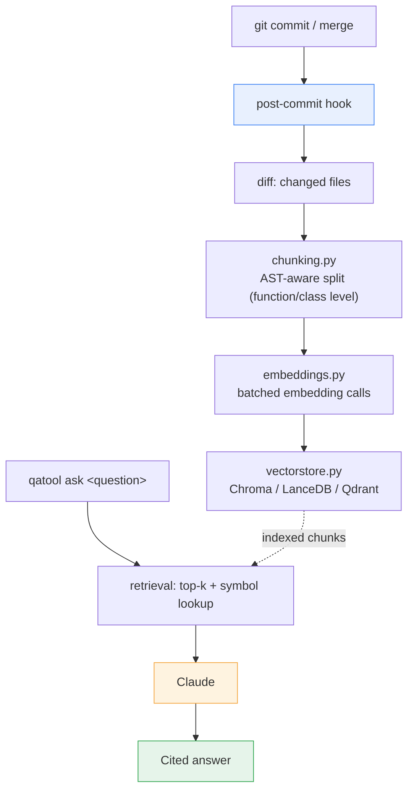
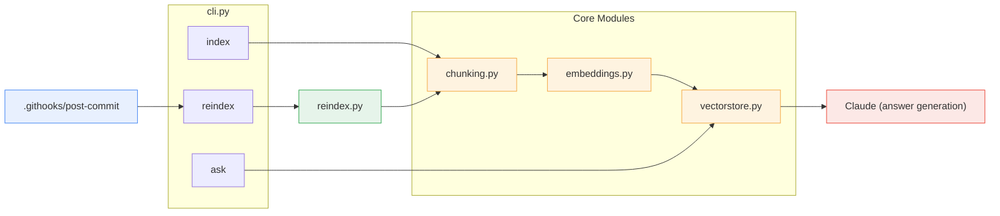
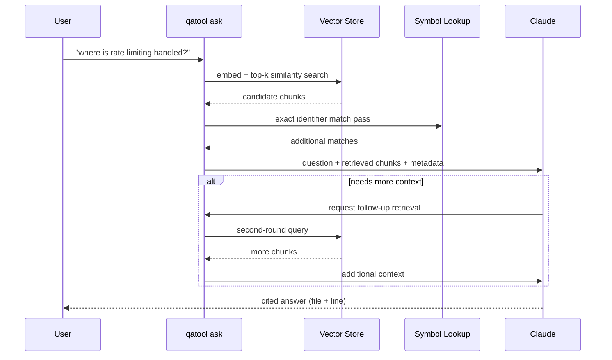
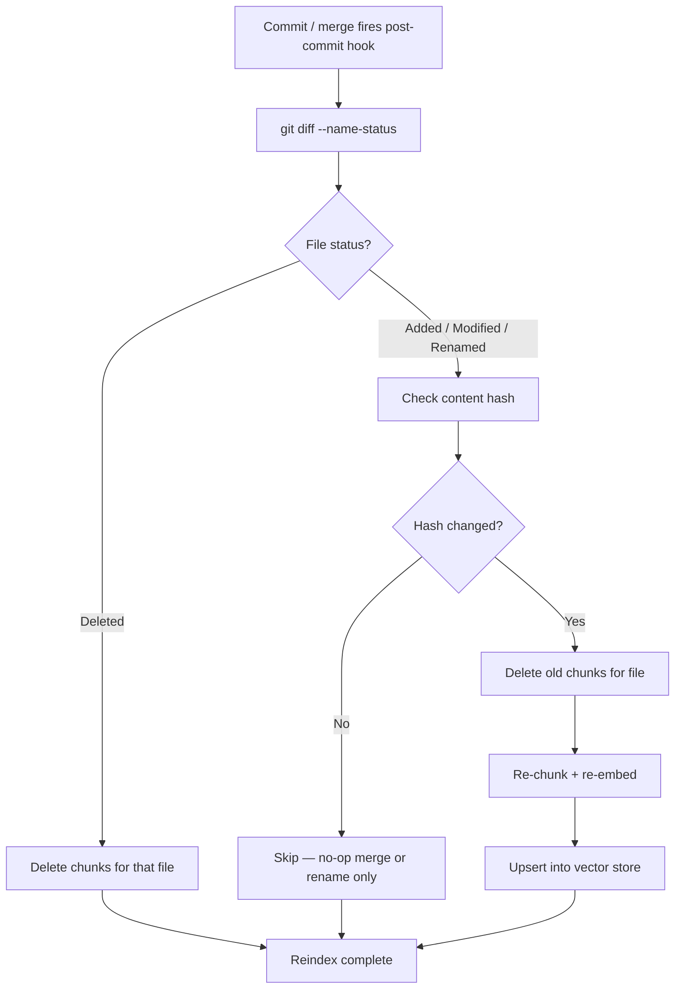

# qatool — Design Doc

**Codebase Q&A Agent**
Status: Draft · v0.1

## 1. Problem

Engineers spend significant time orienting in unfamiliar or large codebases — locating where a behavior is implemented, understanding call chains before making a change, or answering "does this pattern already exist elsewhere." Existing tools (grep, IDE search, docs) require the searcher to already know roughly what they're looking for. qatool lets engineers ask natural-language questions about a codebase and get grounded, cited answers.

## 2. Goals

- Answer natural-language questions about a specific codebase, citing file paths and line numbers.
- Stay current with the codebase automatically (incremental re-indexing on commit), not a stale snapshot.
- Work as a local CLI first; extensible to IDE and Slack surfaces later.
- Keep source code within the user's own infra wherever possible.

## 3. Non-Goals

- Not a general-purpose code generation tool.
- Not a replacement for documentation — it answers "where/how," not "why we chose this" unless that context is separately ingested (ADRs, wiki).
- Not built for codebases that change faster than re-indexing can keep up with (see Risks).

## 4. High-Level Architecture

## 5. Components

| Component | Responsibility | Status |
|---|---|---|
| `chunking.py` | Split files into semantically coherent chunks via tree-sitter (function/class level, not fixed-size windows) | Stub |
| `embeddings.py` | Batched calls to an embedding provider (Voyage AI recommended, pairs well with Claude) | Stub |
| `vectorstore.py` | Thin wrapper over a vector DB; stores chunk text + metadata (file, line range, symbol, content hash) | Stub |
| `reindex.py` | Incremental re-indexing: diffs changed files, skips unchanged content via hash, upserts only what changed | Implemented |
| `cli.py` | `index`, `reindex`, `ask` commands | Skeleton |
| `.githooks/post-commit` | Fires reindex asynchronously after every commit/merge | Implemented |

*Orange = stubbed, green = implemented, blue = entry point, red = external dependency.*

## 6. Retrieval & Answering Flow

1. User runs `qatool ask "<question>"`.
2. Question is embedded and matched against the vector store (top-k similarity).
3. A secondary exact-match pass (grep/AST symbol lookup) catches identifier queries embeddings tend to miss.
4. Retrieved chunks + metadata are passed to Claude with a system prompt instructing it to cite file/line and avoid inventing APIs not present in context.
5. For multi-hop questions ("trace how X flows through the system"), Claude can request a second retrieval round based on what the first pass returned, rather than answering from a single shot.

## 7. Data Freshness

- Full index: `qatool index <repo>` — one-time, walks entire repo.
- Incremental: git hook triggers on every commit/merge, diffing only changed files and re-embedding those. Content hashing avoids re-embedding on no-op merges or pure renames.
- CI can additionally re-index on merge to `main`, so the index reflects the canonical branch rather than someone's local state.

## 8. Interfaces (Rollout Order)

1. **CLI** — proves the pipeline; lowest effort.
2. **IDE extension** — query without leaving the editor; highest daily-use value.
3. **Slack bot** — team-wide, async, low friction.

## 9. Security & Privacy

- Indexing and retrieval run entirely within the user's own infra by default (self-hosted vector DB).
- Only the final Claude call needs external network access — can be routed through Bedrock/Vertex where contractual data handling is required.
- `.qatoolignore` (plus a hard-coded denylist for common secrets paths) excludes sensitive files from ingestion at the chunking step, not just via `.gitignore`.

## 10. Risks & Open Questions

- **Fast-moving codebases**: if commit velocity outpaces re-indexing, answers can reference stale code. Mitigation: async reindexing keeps commits unblocked; a "last indexed at commit X" marker surfaces staleness to the user.
- **Embedding-only retrieval misses exact symbol lookups**: mitigated by the secondary grep/AST pass (Section 6), but this needs validation against real usage.
- **Multi-repo orgs**: index namespacing by `repo_name` is planned but not yet designed in detail.
- **Chunking strategy**: tree-sitter grammar coverage varies by language; need to decide fallback behavior for unsupported languages (currently: whole-file chunk).

## 11. Milestones

1. CLI + full index + basic `ask` (no multi-hop) — MVP
2. Incremental reindex wired to git hook — done in skeleton
3. Multi-hop retrieval loop
4. IDE extension
5. Slack bot
